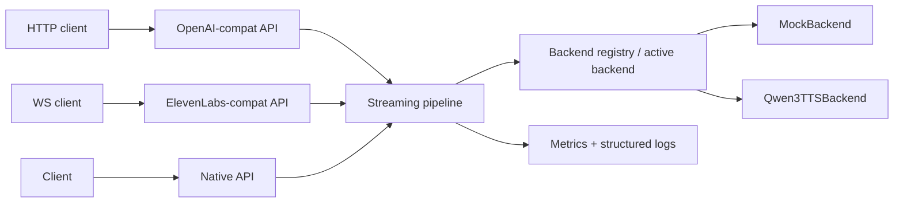

# tts-server

A model-agnostic, plugin-based, CUDA-accelerated streaming TTS inference
server for real-time voice agents. It exposes OpenAI-compatible HTTP TTS,
ElevenLabs-style WebSocket streaming, and a native API for advanced
model-specific features. It supports reproducible benchmarking across
latency, RTF, throughput, GPU memory usage, and streaming stability.

Qwen3-TTS is one backend adapter, not the product — the server is designed
so any TTS model can be plugged in behind the same three API surfaces.

## Architecture



A single asyncio process serves all three API surfaces through one shared
streaming pipeline. FastAPI request handlers are async; blocking model
inference runs in a worker thread and delivers audio chunks back through a
bounded queue. Exactly one backend is active per server process, loaded
once at startup from the backend registry.

## Supported APIs

| API | Method + path | Description |
|---|---|---|
| OpenAI-compatible | `POST /v1/audio/speech` | Synthesize speech; streams raw PCM or returns a WAV file depending on `response_format`. |
| OpenAI-compatible | `GET /v1/models` | List the currently active backend as an OpenAI-shaped model. |
| ElevenLabs-compatible | `WS /v1/text-to-speech/{voice_id}/stream-input` | Stream text in incrementally, receive base64-encoded PCM audio messages back. |
| Native | `POST /api/v1/tts` | Full `TTSRequest` surface (voice, speed, instructions, sample rate, format, backend-specific `extra`), streaming or non-streaming. `stream=true` combined with `format=wav` returns a complete (non-streamed) WAV response, since a valid WAV file needs a header with the final size up front. |
| Native | `WS /api/v1/tts/ws` | Native streaming-input WebSocket with query-string voice/sample-rate control. |
| Native | `GET /api/v1/backends` | List all registered backends with load state and capabilities. |
| Native | `GET /api/v1/backends/{name}` | Detail for one registered backend. |
| Operations | `GET /healthz` | Liveness/readiness, including backend health and GPU memory usage when available. |
| Operations | `GET /metrics` | Prometheus metrics endpoint. |

For streaming responses, an error that occurs after streaming has already
begun surfaces as a truncated/dropped connection on the HTTP APIs, or as a
JSON `error` message followed by a WebSocket close with code 1011 on the WS
APIs — the client should treat an unexpectedly short stream or a 1011 close
as a mid-stream failure, not a clean end of audio.

## Backend capability matrix

| Backend | Streaming output | Streaming input | CUDA | CPU | Voice cloning | Style control | Status |
|---|---|---|---|---|---|---|---|
| mock  | native   | yes | no  | yes | no | no  | stable (dev/CI) |
| qwen3 | emulated | no  | yes | yes | no | yes | experimental — unverified on real GPU hardware |

## Quickstart (mock, no GPU)

```bash
uv sync
uv run uvicorn tts_server.main:app --port 8000
curl -sS localhost:8000/v1/audio/speech -H "Content-Type: application/json" \
  -d '{"input": "hello", "response_format": "wav"}' -o hello.wav
```

`hello.wav` is a 24 kHz mono 16-bit PCM WAV file generated by the
deterministic mock backend — no GPU or model download required.

## Qwen3-TTS setup

The `qwen3` backend wraps the [`qwen-tts`](https://pypi.org/project/qwen-tts/)
PyPI package (`qwen_tts.Qwen3TTSModel`), not a generic
transformers `AutoModel`. It is CUDA-first with a CPU fallback and is
**code-complete but unverified on real GPU hardware** — the development
machine for this project has no GPU.

```bash
uv sync --extra qwen3
TTS_BACKEND=qwen3 uv run uvicorn tts_server.main:app --port 8000
```

The `qwen3` extra installs `torch`, `transformers`, `accelerate`, and
`qwen-tts`. Model weights are downloaded from Hugging Face on first load
(default `Qwen/Qwen3-TTS-12Hz-1.7B-CustomVoice`; override via
`backend.model_path` in the config file, see below) — this requires network
access and disk space, and is not something CI or this repo's tests
exercise.

Minimal `config.yaml` for the qwen3 backend:

```yaml
backend:
  name: "qwen3"
  device: "auto"       # auto | cuda | cpu
  dtype: "bf16"
  model_path: null      # e.g. "Qwen/Qwen3-TTS-12Hz-1.7B-CustomVoice"
  compile: false
  warmup: true
```

`speed` is currently ignored by the `qwen3` backend — the upstream
`qwen_tts.Qwen3TTSModel` API has no speed-control parameter to pass it
through to.

Streaming output for `qwen3` is **emulated**: `generate_custom_voice` (and
its siblings `generate_voice_design`/`generate_voice_clone`) return the
complete waveform for a request — there is no incremental/token-by-token
streaming call at this Python API layer — so the base class re-slices the
full result into chunks. Capabilities report this honestly
(`streaming_mode: "emulated"`).

## Docker/CUDA instructions

```bash
# Build the image (CUDA runtime base; works with or without a GPU attached)
docker build -t tts-server .

# Run with the mock backend, no GPU required
docker run --rm -p 8000:8000 tts-server

# Run with the qwen3 backend on a GPU host (requires nvidia-container-toolkit)
docker run --rm -p 8000:8000 -e TTS_BACKEND=qwen3 --gpus all tts-server
```

Or via Compose:

```bash
docker compose up --build
# TTS_BACKEND=qwen3 docker compose up --build   # to select the qwen3 backend
```

The GPU reservation block in `docker-compose.yml` is commented out by
default (mock backend needs no GPU); uncomment it, and ensure the host has
[`nvidia-container-toolkit`](https://github.com/NVIDIA/nvidia-container-toolkit)
installed, to run the `qwen3` backend under Compose with GPU access.

## API examples

Runnable client examples live under `examples/` (`curl/`, `python/`,
`javascript/`). The Python examples use `httpx` and `websockets`, which are
in the `dev` dependency group — `uv sync` installs them by default;
`uv sync --no-dev` does not, so re-run a plain `uv sync` first if you want
to run them.

```bash
uv run python examples/python/http_client.py   # OpenAI-compatible streaming PCM, reports TTFA
uv run python examples/python/ws_client.py     # ElevenLabs-style streaming-input WebSocket
node examples/javascript/ws_client.mjs         # same, from Node >= 21 (built-in WebSocket)
bash examples/curl/speech.sh                   # OpenAI-compatible curl request
```

ElevenLabs-style WebSocket message shapes:

```jsonc
// client -> server: incremental text, empty "text" signals end of input
{"text": "Hello, "}
{"text": "welcome to our realtime voice demo."}
{"text": ""}

// server -> client: base64 PCM audio chunks, final chunk marked
{"audio": "<base64 pcm_s16le>", "isFinal": false, "backend": "mock"}
{"audio": "<base64 pcm_s16le>", "isFinal": true, "backend": "mock"}
```

## Benchmarks

Reproducible HTTP and WebSocket benchmarks live under `benchmarks/` and
write JSON + Markdown results to `benchmarks/results/`:

```bash
uv run python benchmarks/bench_http.py --backend mock --concurrency 20 --requests 200
uv run python benchmarks/bench_ws.py --backend mock --requests 50
uv run python benchmarks/bench_ws.py --backend mock --requests 50 --streaming-input
```

Both scripts report TTFA, end-to-end latency, and RTF percentiles (p50/p90/p95)
and throughput, and label every result with the backend name. **Published
numbers in this repo are all from the mock backend** — there is no GPU
available to produce real qwen3 numbers yet. Never compare mock-backend
numbers to real-model numbers; re-run both benchmark scripts against
`--backend qwen3` on GPU hardware before drawing any performance
conclusions about the real model.

## Configuration

Layered as defaults → YAML file → environment variable overrides. Example
YAML (`config.example.yaml`):

```yaml
server:
  host: "0.0.0.0"
  port: 8000

backend:
  name: "mock"        # mock | qwen3
  device: "auto"      # auto | cuda | cpu
  dtype: "bf16"
  model_path: null     # e.g. "Qwen/Qwen3-TTS"
  compile: false
  warmup: true

audio:
  default_format: "pcm_s16le"
  sample_rate: 24000
  channels: 1
```

Copy it to `config.yaml` (or point `TTS_CONFIG` at any path) to customize.

| Env var | Overrides |
|---|---|
| `TTS_BACKEND` | `backend.name` |
| `TTS_HOST` | `server.host` |
| `TTS_PORT` | `server.port` |
| `TTS_DEVICE` | `backend.device` |
| `TTS_CONFIG` | path to the YAML config file (default `config.yaml` if present) |

## What's implemented / experimental / future work

**Implemented:** the mock backend (deterministic, native streaming, no
GPU); all four API surfaces (OpenAI-compatible HTTP, ElevenLabs-style
WebSocket, native HTTP + WebSocket, backend introspection); Prometheus
metrics; structured JSON logging with request IDs; reproducible HTTP/WS
benchmarks with JSON+Markdown output; a CUDA-ready Dockerfile and Compose
service.

**Experimental:** the qwen3 adapter (code-complete, GPU-unverified); the
`backend.compile` (`torch.compile`) flag, also unverified on real hardware.

**Future work:** additional backend adapters (Kokoro, Piper); native
(non-emulated) streaming for qwen3 if a future upstream release exposes an
incremental generation API; reference-audio voice cloning.

## License matrix

| Backend | Upstream license | Commercial use |
|---|---|---|
| mock  | Apache-2.0 (this repo) | yes |
| qwen3 | see the Qwen3-TTS model card on Hugging Face | verify upstream license before commercial deployment |

Model weights are never redistributed by this project. Always verify the
upstream model license before commercial use.

## License

The server code is licensed under [Apache-2.0](LICENSE).
