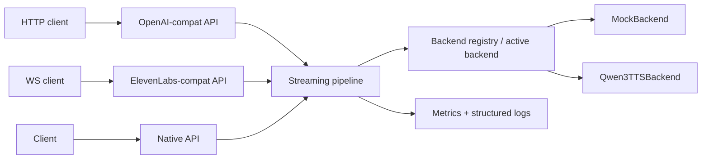

# TTS Inference Server — Design Spec

**Date:** 2026-07-03
**Status:** Approved
**Source requirements:** `prompts.md`

## Summary

An open-source, model-agnostic, CUDA-accelerated, low-latency streaming TTS inference server for real-time voice agents. It exposes OpenAI-compatible HTTP TTS, ElevenLabs-style WebSocket streaming, and a native API for advanced model-specific features, with a plugin-based backend adapter architecture and reproducible benchmarks. Qwen3-TTS is one backend adapter, not the product.

## Assumptions and constraints

1. **No local CUDA.** Development machine is macOS. Day-to-day development and CI run against MockBackend. The Qwen3 adapter is written CUDA-first with CPU fallback but is flagged *unverified on real hardware* until GPU access exists. Published benchmark numbers are mock-labeled until real-GPU runs happen.
2. **Third real backend (Kokoro/Piper) is deferred** to future work; the registry and protocol are designed so adding one takes under 30 minutes of adapter work.
3. **Config precedence:** built-in defaults → YAML file (path via `TTS_CONFIG`, default `config.yaml`) → environment variable overrides (e.g. `TTS_BACKEND=mock`).
4. Python 3.12+, `uv` for project management, FastAPI/Starlette on uvicorn, asyncio-native. No secrets in code or logs.
5. Single active backend per server process, loaded once at startup.

## Architecture

Single-process asyncio server. FastAPI handlers are async; blocking model inference (torch) runs in a worker thread (`asyncio.to_thread` or a dedicated inference thread), delivering audio chunks to the async world through a bounded `asyncio.Queue`. One shared streaming pipeline normalizes all backend output to `AsyncIterator[TTSChunk]`.

Alternatives considered and rejected: separate inference worker processes (better isolation/multi-GPU, but IPC and lifecycle complexity is unjustified at this scale) and per-model microservers behind a gateway (over-engineered). The backend protocol keeps the door open to a worker-process model later without API changes.



## Components

### 1. Core types (`src/tts_server/models.py`)

Pydantic models:

- `AudioFormat` — enum: `pcm_s16le`, `wav`.
- `TTSRequest` — `text`, `voice`, `speed`, `instructions`, `sample_rate`, `format`, `request_id`, `extra: dict[str, Any]` for backend-specific params.
- `TTSChunk` — `audio: bytes` (raw PCM), `sample_rate`, `is_final`, `sequence`.
- `TTSResult` — full audio bytes plus format/sample-rate metadata and timing.
- `VoiceInfo`, `ModelInfo`, `BackendHealth`.
- `TTSCapabilities` — `supports_streaming_input`, `supports_streaming_output`, `streaming_mode: Literal["native", "emulated", "none"]`, `supports_voice_cloning`, `supports_reference_audio`, `supports_emotion_or_style_control`, `supports_cuda`, `supports_cpu`, `supported_languages`, `supported_sample_rates`, `supported_audio_formats`.

**Honesty rule:** capabilities describe what the adapter actually does. Emulated streaming is labeled `emulated` in capabilities, API responses where relevant, and the README. No feature is claimed that is not implemented and exercised by a test.

### 2. Backend protocol (`src/tts_server/backends/base.py`)

```python
class TTSBackend(ABC):
    name: str
    capabilities: TTSCapabilities

    async def load(self) -> None: ...
    async def synthesize(self, request: TTSRequest) -> TTSResult: ...
    async def synthesize_stream(self, request: TTSRequest) -> AsyncIterator[TTSChunk]: ...
    async def close(self) -> None: ...
    async def health(self) -> BackendHealth: ...
    def list_voices(self) -> list[VoiceInfo]: ...
```

Contract:

- `synthesize_stream()` always works. The base class provides a default implementation that calls `synthesize()` and re-slices the result into paced chunks (emulated streaming). Backends with native streaming override it. Callers never branch on backend type; only capability metadata differs.
- `load()` is called once during server startup (FastAPI lifespan), followed by optional warmup synthesis. `close()` releases GPU memory and threads on shutdown.
- Backends raise `UnsupportedFeatureError` for requested features outside their capabilities; the API layer maps this to a structured 400.

### 3. Registry and config (`backends/registry.py`, `config.py`)

- Registry is a plain dict `name -> factory` with **lazy imports**, so heavy dependencies (torch, transformers) are only imported when that backend is selected. Registered names: `mock`, `qwen3`.
- Optional dependencies are `uv` extras: `uv sync` gives mock-only; `uv sync --extra qwen3` adds the Qwen3 stack.
- Config is a Pydantic Settings hierarchy matching the YAML shape from the requirements (`server`, `backend`, `audio` sections) with env-var overrides. Backend section includes `device`, `dtype`, `model_path`, `compile`, `warmup`.

### 4. Backends

**MockBackend** (`backends/mock.py`)

- No GPU, no downloads. Generates deterministic synthetic PCM (sine tone keyed on text hash) with duration proportional to text length.
- Configurable synthetic first-chunk latency and inter-chunk pacing so it realistically exercises streaming, cancellation, backpressure, benchmarks, and CI.
- Capabilities: native streaming output, streaming text input, CPU only.

**Qwen3TTSBackend** (`backends/qwen3.py`)

- Loads the model once at startup via the official Qwen3-TTS distribution (HF `transformers` or upstream package — confirmed at implementation time).
- `device="cuda"` with bf16 when available; CPU fallback. `torch.compile` behind a config flag, off by default.
- Streaming output: native **only if** the upstream implementation exposes incremental generation; otherwise the emulated default is used and capabilities say `emulated`. Determined by inspecting upstream at implementation time — not assumed.
- Maps `voice` to model voice selection and `instructions` to style/instruction text where the model supports it.
- Warmup: one short synthesis after load when `warmup: true`.
- Status: code-complete in v1 but flagged unverified-on-GPU until tested on real hardware.

### 5. Streaming layer (`src/tts_server/streaming/`)

- `audio.py` — PCM slicing into fixed-duration chunks, WAV header wrapping, base64 encoding for WS messages.
- `pipeline.py` — the shared abstraction wrapping any backend stream with:
  - **cancellation:** client disconnect cancels the inference task and drains the queue;
  - **timeout:** per-request wall-clock timeout from config;
  - **backpressure:** bounded `asyncio.Queue` between the producer (inference thread) and the sender coroutine;
  - **timing capture:** records TTFA and total latency per request for metrics.
- `websocket.py` — ElevenLabs-style session state machine: buffers incremental text messages, triggers synthesis on flush (empty-text message, explicit `{"flush": true}`, or close), emits JSON messages `{audio: <base64>, isFinal, backend, request_id}`. For backends without streaming text input, text accumulates and synthesis runs once on flush; the capability report makes this visible.

Streaming **input** and streaming **output** are independent axes. A backend may support: full text → full audio; full text → streaming audio; streaming text → streaming audio. `TTSCapabilities` reports each axis separately.

### 6. API surfaces (`src/tts_server/api/`)

**OpenAI-compatible** (`openai_compat.py`)

- `POST /v1/audio/speech` — request body: `model`, `input`, `voice`, `response_format` (`pcm`|`wav`), `speed`, `instructions`. Returns chunked `StreamingResponse` for pcm; wav returned complete (or streamed with a header once total length is known — pcm is the realtime path). `model` omitted → configured default. Unsupported features → 400 with a body that includes the active backend's capabilities.
- `GET /v1/models` — OpenAI-compatible model listing derived from the active backend's `ModelInfo`.

**ElevenLabs-style WebSocket** (`elevenlabs_compat.py`)

- `GET /v1/text-to-speech/{voice_id}/stream-input` — protocol exactly as specified in the requirements: client sends `{"text": ...}` chunks, empty text finalizes; server sends base64 audio messages with `isFinal`, `backend`, `request_id`.

**Native API** (`native.py`)

- `POST /api/v1/tts` — full `TTSRequest` including backend-specific `extra` params, reference-audio metadata, explicit sample rate/format/streaming mode.
- `GET /api/v1/tts/ws` — native WebSocket variant of the same.
- `GET /api/v1/backends` and `GET /api/v1/backends/{name}` — registered backends, loaded state, capabilities.
- Kept deliberately small in v1.

**Utility** (`health.py`)

- `GET /healthz` — server status + active backend health.
- `GET /metrics` — Prometheus text format via `prometheus-client`.

### 7. Metrics, logging, errors

- **Metrics** (`metrics/`): request count, failure count, active sessions, TTFA histogram, total-latency histogram, RTF histogram, backend error counter; GPU memory gauge when torch + CUDA are present.
- **Logging** (`logging_config.py`): structured JSON logs to `logs/<startup-timestamp>.log` — a new file per server startup — plus human-readable console output. Every record carries the request ID. No secrets, tokens, or full user text in logs (text is logged truncated).
- **Errors** (`errors.py`): small hierarchy — `TTSServerError` → `UnsupportedFeatureError`, `BackendNotLoadedError`, `SynthesisError`, `RequestTimeoutError` — with a FastAPI exception handler mapping to consistent JSON error bodies and WS error messages.
- **Graceful shutdown:** lifespan teardown cancels active sessions, calls `backend.close()`, flushes logs.

### 8. Benchmarks (`benchmarks/`)

- `bench_http.py` — CLI: `--backend`, `--concurrency`, `--requests`, `--text-file`; measures TTFA, end-to-end latency, RTF, p50/p90/p95, throughput, failure rate.
- `bench_ws.py` — CLI with `--streaming-input`; additionally compares true-streaming vs emulated-streaming TTFA.
- GPU peak memory read from `/metrics` during runs when available.
- Output: JSON + generated Markdown table per run under `benchmarks/results/`, each stamped with backend name, config, and an explicit `mock` label when the mock backend produced the numbers. **No fabricated numbers, ever.**

### 9. Testing (`tests/`)

pytest + httpx + Starlette's WebSocket test client; everything runs without GPU:

- backend protocol contract (including the emulated-streaming default implementation)
- registry resolution and lazy import behavior
- MockBackend determinism and chunk pacing
- OpenAI endpoint request validation and error shapes
- ElevenLabs WS message protocol (incremental text, flush, isFinal, request_id)
- capability reporting endpoints
- metrics output format
- unsupported-feature 400s, timeout, and cancellation paths

### 10. Packaging, docs, repo layout

- Repo layout as specified in the requirements (`src/tts_server/…`, `examples/{curl,python,javascript}`, `benchmarks/`, `tests/`, `docs/`).
- `Dockerfile` on a CUDA runtime base image + `docker-compose.yml`; mock backend also runs in a slim CPU image path.
- README covering: positioning (model-agnostic server, Qwen3-TTS as one adapter — never "a Qwen3 wrapper"), API compatibility, backend capability matrix, quickstart with uv, mock quickstart, Qwen3 setup, Docker/CUDA instructions, API examples, benchmark instructions, Mermaid architecture diagram, implemented / experimental / future-work sections, and a **backend license matrix** telling users to verify upstream model licenses before commercial use. No model weights redistributed.

## Implementation order

1. Project scaffolding (uv, pyproject, git), core types, backend protocol
2. Registry + config
3. MockBackend
4. OpenAI-compatible HTTP endpoint + `/v1/models`
5. ElevenLabs-style WebSocket endpoint
6. Metrics, logging, health, graceful shutdown
7. Qwen3TTSBackend
8. Examples and tests (grown alongside each phase; consolidated here)
9. Benchmarks
10. README and docs, Docker
11. (Future) additional lightweight backend (Kokoro or Piper)

Each phase leaves the server runnable and tested. Smallest complete version first; no speculative abstractions.

## Success criteria

- `uv run uvicorn tts_server.main:app` serves all endpoints with MockBackend, no GPU, no downloads.
- All tests pass in CI without GPU.
- A developer can add a new backend adapter by implementing the `TTSBackend` ABC and registering one factory — under 30 minutes for a simple model.
- Capability reporting is truthful for every backend, including emulated streaming.
- Benchmarks are reproducible from documented CLI commands and clearly labeled by backend.
